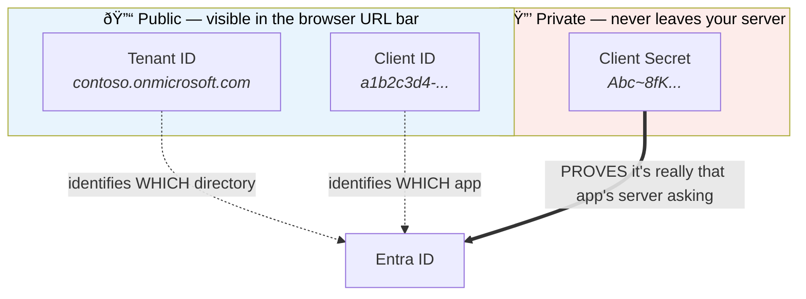
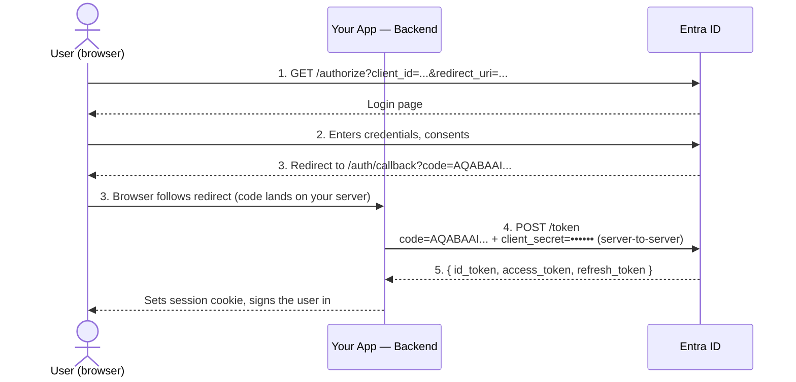
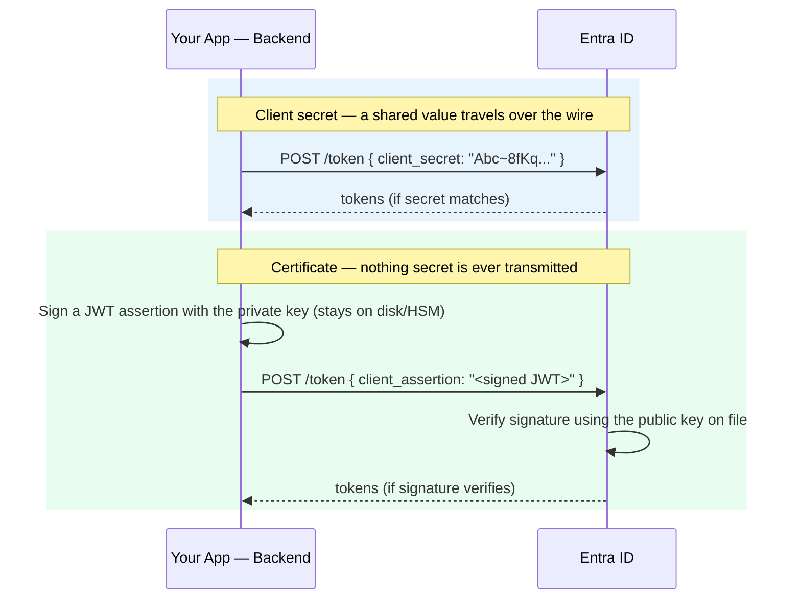
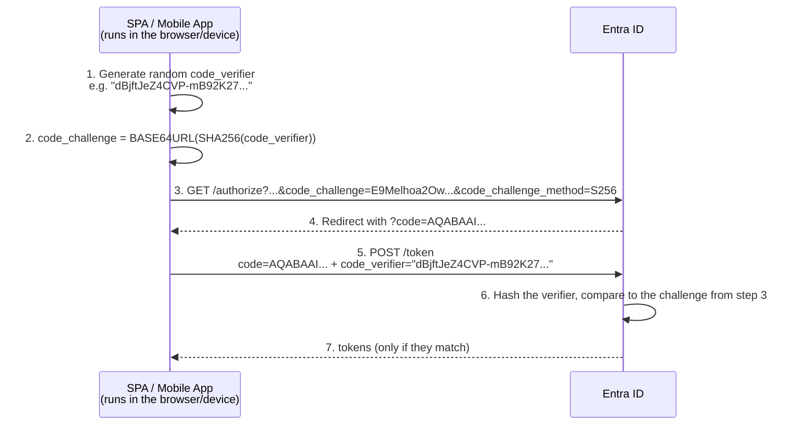
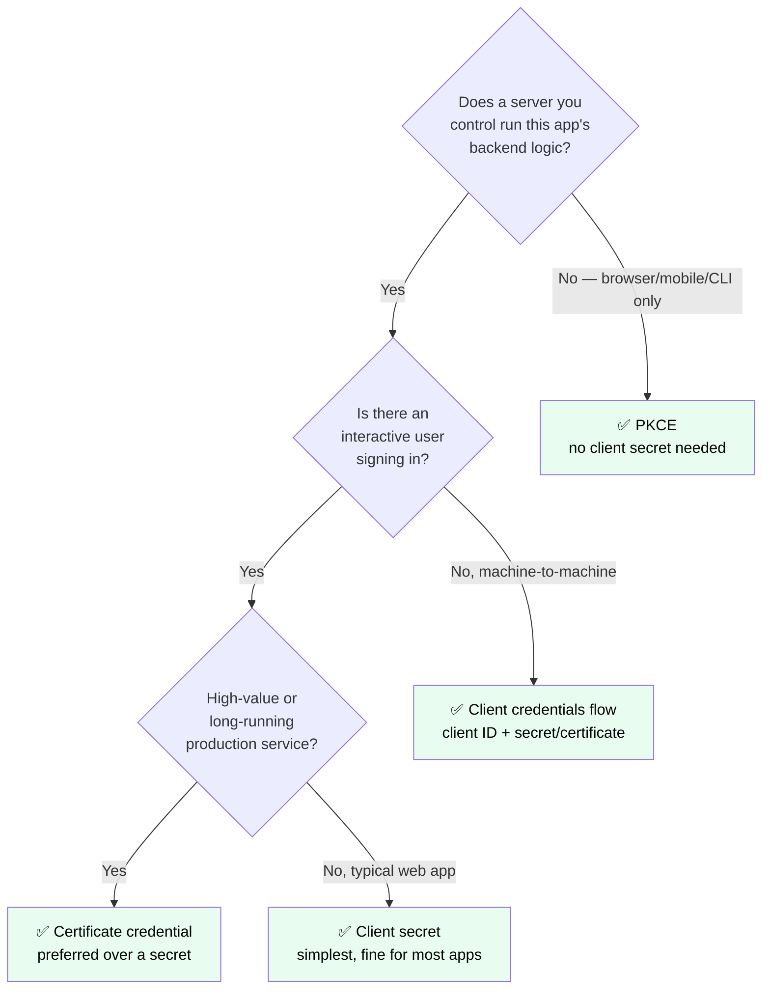

# Microsoft Entra ID Authentication — Concepts Reference

A generic reference for how Microsoft Entra ID (formerly Azure AD) authentication
works for web applications. This is not specific to any one app — it explains the
underlying OAuth 2.0 / OIDC concepts you'll run into when wiring up "Sign in with
Microsoft" for any project.

## The big picture

```mermaid
flowchart LR
    U["👤 User<br/>(browser)"]
    A["🖥️ Your App<br/>Frontend + Backend"]
    E["☁️ Microsoft Entra ID<br/>/authorize · /token"]

    U <-->|"1. sign in / consent"| E
    U <-->|"2. loads pages, session cookie"| A
    A <-->|"3. code exchange (server-to-server)<br/>client secret sent here only"| E

    style E fill:#0078d4,color:#fff
    style A fill:#2b2b2b,color:#fff
    style U fill:#666,color:#fff
```



The user only ever talks to Entra directly for the sign-in screen. Your app's
**backend** — not the browser — is the only party that ever presents the
client secret. That single fact drives everything below.

## The three identifiers you'll configure

| Value | Secret? | Purpose |
| --- | --- | --- |
| **Tenant ID** | No | Which Entra directory (organization) issues and validates tokens. |
| **Client ID** (Application ID) | No | Which registered app is requesting sign-in. Public — it appears in redirect URLs and browser requests. |
| **Client Secret** | **Yes** | Proves that a *specific* token request genuinely came from your app's backend, not from someone who merely observed the Client ID. |

A common assumption is that Tenant ID + Client ID should be enough to identify
and authenticate an app. They identify the app, but they don't *authenticate*
it — anyone can read them off the wire. The secret is what separates
"identifying yourself" from "proving it's you."



**Example — a real `/authorize` redirect URL.** Everything in it is public;
none of it grants access on its own:

```text
https://login.microsoftonline.com/{tenant-id}/oauth2/v2.0/authorize
  ?client_id=a1b2c3d4-5e6f-7890-abcd-ef1234567890
  &response_type=code
  &redirect_uri=https://myapp.example.com/auth/callback
  &scope=openid profile email
  &state=xK9f...              (anti-CSRF, generated per login attempt)
```

Anyone who views the page source, checks browser history, or inspects network
traffic can read every one of these values. That is fine — none of them alone
lets you obtain a token.

## Why the client secret exists: confidential vs. public clients

OAuth 2.0 splits apps into two categories:

- **Confidential clients** — server-side apps (traditional web apps, backend
  APIs) that can keep a secret hidden from end users, because the secret lives
  only on the server and is never sent to the browser.
- **Public clients** — apps that *can't* keep a secret safely, because their
  code runs somewhere a user could extract it: single-page apps (SPAs), mobile
  apps, desktop apps, CLI tools.

A server-rendered web app that handles login on the backend is a confidential
client, so it registers with a **client secret** (or a certificate, which is
the stronger alternative — see below). A public client instead uses **PKCE**
(Proof Key for Code Exchange), which achieves a similar guarantee without a
persisted secret. Some apps have both a backend and a public client (e.g. a
SPA calling an API) — hybrid flows exist for that, but the core split above
still applies.

```mermaid
flowchart LR
    subgraph Confidential["Confidential client"]
        direction TB
        CA["Traditional web app<br/>Next.js / ASP.NET / Django backend"]
        CB["Backend API / daemon service"]
    end
    subgraph Public["Public client"]
        direction TB
        PA["Single-page app (React/Vue in-browser)"]
        PB["Mobile app"]
        PC["Desktop / CLI tool"]
    end

    Confidential -->|"holds a secret or cert"| Secret["🔒 Client secret /<br/>certificate"]
    Public -->|"cannot hide a secret<br/>→ uses PKCE instead"| Pkce["🔑 PKCE code_verifier<br/>(generated fresh, never stored)"]

    style Confidential fill:#e8f4fd,color:#000
    style Public fill:#fff4e5,color:#000
```



**Examples:**

| App | Type | Why |
| --- | --- | --- |
| A Next.js app where `/auth/callback` runs server-side and exchanges the code | Confidential | The secret lives in an env var / Key Vault on the server; the browser never sees it. |
| A React SPA that calls Microsoft Graph directly from the browser with MSAL.js | Public | The secret would ship inside the JS bundle — anyone could extract it with dev tools. |
| A nightly batch job that reads a mailbox with no user present | Confidential (client credentials flow) | No user, no browser — the service itself authenticates with its own secret/certificate. |
| A CLI tool (`az login`, `gh auth login`) | Public | Runs on a user's machine; a bundled secret would be trivially extractable from the binary. |

## The authorization code flow, step by step

This is the standard flow for confidential-client web apps (the same shape
Entra ID uses under the OpenID Connect standard):

1. **Redirect to Entra.** The browser is sent to Entra's `/authorize` endpoint
   with the app's Client ID, Tenant ID, requested scopes, and a redirect URI.
   All of this is visible in the URL — none of it is secret.
2. **User authenticates.** The user signs in (or Entra recognizes an existing
   session) and consents to the requested permissions.
3. **Entra redirects back with a one-time authorization code.** This code is
   short-lived (usually ~60–600 seconds) and single-use, but it is still just
   a value that travels through the browser — it can end up in browser
   history, server logs, a referrer header, or be intercepted by a malicious
   redirect.
4. **The app's backend exchanges the code for tokens.** This step happens
   server-to-server (not through the browser): the backend calls Entra's
   `/token` endpoint, presenting the authorization code **and the client
   secret**.
5. **Entra validates the secret before issuing tokens.** Only if the secret
   matches the registered app does Entra return an ID token / access token /
   refresh token.



**Example — the code exchange request** (step 4, sent by your server, never
by the browser):

```bash
curl -X POST "https://login.microsoftonline.com/{tenant-id}/oauth2/v2.0/token" \
  -H "Content-Type: application/x-www-form-urlencoded" \
  -d "client_id=a1b2c3d4-5e6f-7890-abcd-ef1234567890" \
  -d "client_secret=Abc~8fKq2ZpR9v.example-secret-value" \
  -d "grant_type=authorization_code" \
  -d "code=AQABAAIAAAAmoFfGtYxvRrNriQdPKlz6...redacted..." \
  -d "redirect_uri=https://myapp.example.com/auth/callback"
```

**Example — a successful response:**

```json
{
  "token_type": "Bearer",
  "expires_in": 3600,
  "access_token": "eyJ0eXAiOiJKV1QiLCJhbGciOi...",
  "id_token": "eyJ0eXAiOiJKV1QiLCJhbGciOi...",
  "refresh_token": "0.AXoA...opaque, long-lived..."
}
```

**Example — the same request without the correct secret** (e.g. an attacker
who intercepted the `code` but doesn't have your server's secret):

```json
{
  "error": "invalid_client",
  "error_description": "AADSTS7000215: Invalid client secret provided..."
}
```

The `code` alone is worthless without it — this is the entire point of the
secret.

### What the secret actually prevents

Without step 4's secret check, anyone who obtained a leaked authorization code
(from a log, a proxy, a browser extension, a compromised redirect target)
could redeem it themselves and receive tokens for the victim's session — full
account takeover, no password needed. The secret means a bare authorization
code is not enough; the attacker would also need something that only lives on
your server.

This is why the client secret is typically marked `@secure()` / a Key Vault
reference / an environment variable that's never logged, never sent to the
browser, and never committed to source control.

## Client secret vs. certificate credentials

Entra app registrations support two ways to satisfy the "confidential client"
requirement:

- **Client secret** — a generated string, simple to set up, but it's a
  long-lived bearer credential: whoever holds it can authenticate as the app
  until it's rotated or expires (Entra secrets expire on a schedule you set,
  max ~24 months).
- **Certificate credential** — the app proves possession of a private key by
  signing a JWT assertion, rather than sending a shared secret over the wire
  at all. Stronger (nothing bearer-style is transmitted), harder to leak by
  accident, and preferred for production/service-to-service scenarios. Costs
  more setup (managing a certificate and its rotation).

For most interactive user-login web apps, a client secret is the common
choice; for high-value or long-running service identities, prefer a
certificate.



**Example — client secret config (e.g. Bicep/ARM parameter):**

```bicep
@secure()
param entraClientSecret string   // generated string, rotates every ~6-24 months
```

**Example — certificate config (conceptually):**

```text
1. Generate a key pair; upload the public key (.cer) to the Entra app registration.
2. Your server keeps the private key (ideally in a HSM / Key Vault-backed key).
3. At token-request time, your server signs a short-lived JWT with the private key
   and sends that signed JWT instead of a shared secret string.
```

## PKCE — the public-client equivalent

Single-page apps and mobile apps can't hold a client secret, so they use PKCE
instead:

1. The app generates a random `code_verifier` and derives a `code_challenge`
   (a hash of it).
2. The `code_challenge` is sent with the initial `/authorize` redirect.
3. When exchanging the authorization code for tokens, the app sends the
   original `code_verifier`.
4. Entra checks that the verifier hashes to the challenge it saw in step 2.

This proves the token exchange is coming from the *same app instance* that
started the flow, without requiring a secret that a public client could never
protect anyway. Confidential clients can also use PKCE in addition to a
secret/certificate for defense in depth, but it's mandatory for public
clients.



**Example — the values involved (illustrative):**

```text
code_verifier   = dBjftJeZ4CVP-mB92K27uhbUJU1p1r_wW1gFWFOEjXk   (random, kept in memory only)
code_challenge  = E9Melhoa2OwvFrEMTJguCHaoeK1t8URWbuGJSstw-cM   (SHA256 + base64url of the verifier)
code_challenge_method = S256
```

No secret is ever stored in the app's code or bundle — `code_verifier` is
generated fresh for each login attempt and thrown away once the exchange
completes.

## Quick decision guide



| Your app is... | Use |
| --- | --- |
| A server-rendered web app / backend that handles the login redirect | Client secret or certificate credential |
| A SPA, mobile app, or CLI tool with no trusted backend | PKCE, no client secret |
| A backend service calling another API with no interactive user | Client credentials flow (client ID + secret/certificate, no user involved) |
| A high-value production service identity | Certificate credential over a client secret where possible |

## Further reading

- [Microsoft identity platform authentication flows](https://learn.microsoft.com/entra/identity-platform/authentication-flows-app-scenarios)
- [OAuth 2.0 authorization code flow](https://learn.microsoft.com/entra/identity-platform/v2-oauth2-auth-code-flow)
- [Public client and confidential client applications](https://learn.microsoft.com/entra/identity-platform/msal-client-applications)
- [Proof Key for Code Exchange (PKCE)](https://learn.microsoft.com/entra/identity-platform/v2-oauth2-auth-code-flow#request-an-authorization-code)
