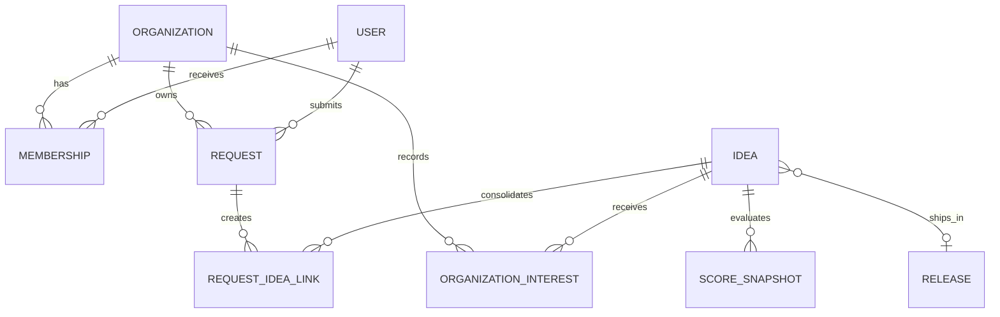

# DataCentral Pulse

## Product Requirements Document

| Field | Value |
| --- | --- |
| Product | DataCentral Pulse |
| Document status | Draft v1.0 — ready for product and engineering review |
| Date | 14 July 2026 |
| Product owner | DataCentral Product Team |
| Primary audience | Product, engineering, design, customer success, sales, and selected customers |
| Initial release | Responsive web application |

> **Working assumption:** DataCentral Pulse will be a standalone application that can also be opened from inside DataCentral. It will initially support email OTP and Microsoft Entra ID authentication. The Entra Application (client) ID and Azure Tenant ID will be configured later. Users may belong to several customer companies through explicit memberships and may hold a different role in each company. The application will be designed for English and Icelandic localization.

---

## 1. Executive summary

DataCentral Pulse is a modern customer-feedback and product-planning application for collecting, consolidating, prioritizing, and communicating feature requests.

Customers need a quick way to explain what they are trying to achieve and to see what happens next. The DataCentral team needs one reliable place to understand demand across customers, find duplicate requests, assess business impact, plan product work, and close the feedback loop without exposing confidential customer information.

The product therefore separates two concepts:

1. A **customer request** is the original, customer-specific submission. It contains the customer's context, attachments, urgency, and discussion and is never automatically shared with other customers.
2. A **product idea** is the canonical DataCentral item used to combine related requests, make prioritization decisions, publish a safe customer-facing summary, and track delivery.

This separation is central to the product. It allows ten customers to ask for essentially the same capability in different ways while DataCentral manages one product idea, preserves each customer's private context, and communicates consistently.

The MVP will provide:

- authenticated customer and internal workspaces;
- fast request submission with duplicate suggestions;
- private, organization, and published visibility controls;
- an internal triage inbox;
- canonical product ideas that consolidate customer demand;
- status updates, comments, notifications, and a Now/Next/Later roadmap;
- transparent prioritization inputs and product analytics;
- strong tenant isolation and a full audit history.

AI-assisted duplicate detection and summarization are useful enhancements, but the core workflow must function fully without AI.

---

## 2. Problem statement

Feature requests currently arrive through meetings, email, chat, support conversations, sales discussions, and internal notes. This creates predictable problems:

- customers do not know whether a request was recorded or what happened to it;
- similar requests are described differently and counted separately;
- important business context is lost when requests are copied into development tasks;
- loud or recent customers can appear more important than broader demand;
- customer-specific or commercially sensitive details may be exposed if raw requests are shared;
- product decisions and their reasoning are hard to reconstruct;
- customer success and sales cannot confidently answer roadmap questions;
- released capabilities are not reliably communicated back to the people who requested them.

DataCentral needs a structured feedback system, not another generic ticket list.

---

## 3. Product vision

Create the easiest and most trustworthy place for DataCentral customers to influence the product—and the clearest place for the DataCentral team to turn fragmented feedback into deliberate product decisions.

### 3.1 Product principles

1. **Start with the problem.** Ask what the customer needs to achieve before asking for a proposed feature.
2. **Fast to submit.** A useful request should take less than two minutes to submit.
3. **Private by default.** Raw customer content is never exposed to another organization.
4. **One demand signal, many sources.** Consolidate related requests without losing customer-specific context.
5. **Transparent, not overcommitted.** Show progress and reasoning without turning roadmap views into contractual promises.
6. **Human product decisions.** Scores and AI provide evidence; they never make or publish decisions automatically.
7. **Close the loop.** Every meaningful status change should reach the customers who care about it.
8. **Useful before it is clever.** Search, triage, statuses, and communication must work well without AI.

---

## 4. Goals and success measures

### 4.1 Product goals

- Give every customer request a clear owner, status, and history.
- Reduce duplicate product work by consolidating similar requests.
- Make demand visible by customer organization, affected users, strategic value, and commercial context.
- Give customers a credible, low-friction view of progress.
- Reduce manual follow-up by customer success, sales, and product staff.
- Create a durable evidence trail for product-prioritization decisions.

### 4.2 Success metrics

Targets should be measured after a 30-day baseline period.

| Metric | Initial target |
| --- | ---: |
| Median time to submit a request | Under 2 minutes |
| Requests acknowledged automatically | 100% |
| New requests triaged within 5 business days | At least 90% |
| Requests linked to an existing or new canonical idea | At least 80% |
| Median time from release to requester notification | Under 1 business day |
| Customer-visible status changes with an explanation | At least 95% |
| Requests submitted outside email/chat after rollout | At least 70% within 3 months |
| Monthly active internal product users | At least 80% of licensed internal users |
| Customers rating the process as clear or very clear | At least 80% |

### 4.3 Guardrail metrics

- Fewer than 1% of external page requests may produce authorization errors caused by incorrect tenant scoping.
- Zero cross-customer data exposure incidents.
- Fewer than 10% of submitted requests should be abandoned because the form is too long.
- Notification unsubscribe rate should remain below 10% per month.

---

## 5. Scope

### 5.1 MVP scope

- User authentication and organization membership.
- Customer and internal roles.
- Customer request creation, editing, attachments, drafts, and history.
- Search and duplicate suggestions using deterministic text search.
- Customer request visibility controls.
- Internal triage and assignment.
- Creation of canonical product ideas and linking of multiple requests.
- Customer-safe product descriptions and status updates.
- Search, filters, saved views, and sorting.
- Following and organization-level interest signals.
- Internal notes and customer-visible discussions.
- Now/Next/Later roadmap and release notes.
- Email and in-app notifications.
- Prioritization inputs and configurable scoring.
- Dashboard analytics and CSV export.
- Audit log, retention controls, and administrative settings.
- Responsive, accessible interface with localization support.

### 5.2 Later releases

- Semantic/AI duplicate detection.
- AI-assisted summaries, themes, and suggested tags.
- Native integrations with Azure DevOps, GitHub, Linear, HubSpot, email, and chat tools.
- In-product feedback widget embedded directly in DataCentral modules.
- Customer surveys and outcome validation after release.
- Public, unauthenticated roadmap.
- Advanced portfolio planning, capacity planning, and scenario comparison.
- Mobile push notifications.
- Automatic extraction of feature requests from meetings, email, or support conversations.

### 5.3 Explicit non-goals

- Replacing a software development issue tracker or sprint board.
- Replacing customer support or incident management.
- Guaranteeing that a popular request will be built.
- Exposing customer names, ARR, contracts, attachments, or raw comments to other customers.
- Allowing AI to publish, merge, decline, or prioritize items without human confirmation.
- Providing contractual delivery dates through the roadmap.

---

## 6. Users and roles

### 6.1 Personas

#### Customer requester

A DataCentral user who has an idea, missing capability, or workflow problem. Wants to submit it quickly, add context, and follow progress.

#### Customer administrator

Represents a customer organization. Wants visibility into organization requests, the ability to clarify priorities, and fewer duplicate submissions from colleagues.

#### Partner or reseller

Works with several customer organizations. Wants to submit feedback on behalf of a named customer while keeping each customer's information isolated.

#### Customer success or sales user

Captures feedback from conversations, connects it to customers and opportunities, and needs an accurate answer when customers ask about progress.

#### Product manager

Owns triage, discovery, prioritization, roadmap communication, and product decisions. Needs consolidated evidence rather than a flat vote count.

#### Product contributor

An internal engineer, designer, support specialist, or subject-matter expert who can add analysis and estimates but cannot publish product commitments.

#### System administrator

Manages organizations, users, roles, taxonomy, integrations, retention, notification defaults, and security settings.

### 6.2 Permission matrix

`Own` means created by the user. `Organization` means the user's customer organization. Internal users are members of the DataCentral organization.

| Capability | Customer requester | Customer admin | Partner | Internal contributor | Product manager | System admin |
| --- | ---: | ---: | ---: | ---: | ---: | ---: |
| Submit a request | Yes | Yes | On behalf of permitted customers | Yes | Yes | Yes |
| View own private requests | Yes | Yes | Yes | N/A | Yes | Yes |
| View organization requests | If shared with organization | Yes | Per delegated customer | N/A | Yes | Yes |
| Edit a submitted request | Own, while editable | Organization, with history | Delegated requests | Assigned | Yes | Yes |
| Follow a published idea | Yes | Yes | Yes | Yes | Yes | Yes |
| Add customer-visible comment | Permitted items | Organization items | Delegated items | Yes | Yes | Yes |
| Add internal note | No | No | No | Yes | Yes | Yes |
| Access the triage inbox | No | No | No | Yes | Yes | Yes |
| Link requests to ideas | No | No | No | If granted | Yes | Yes |
| Set internal score fields | No | No | No | If granted | Yes | Yes |
| Change internal status | No | No | No | If granted | Yes | Yes |
| Publish external wording/status | No | No | No | No | Yes | Yes |
| Manage roadmap and releases | No | No | No | No | Yes | Yes |
| View commercial data | No | No | No | If granted | Yes | Yes |
| Manage system settings | No | No | No | No | No | Yes |

All permissions must be enforced server-side. Hiding a control in the interface is not authorization.

---

## 7. Core product model

### 7.1 Customer request

The original record of a customer's need. It includes the customer's own wording, context, attachments, urgency, target date, affected users, workaround, and discussion.

A customer request:

- belongs to exactly one customer organization;
- has one creator and may have an internal owner;
- may be visible only to the requester or to the requester's organization;
- may be linked to one or more canonical product ideas;
- retains its own history even if linked, merged, withdrawn, or closed;
- is never directly published to other customers.

### 7.2 Product idea

The canonical product record maintained by DataCentral. It expresses a product problem or capability in consistent language and can consolidate many customer requests.

A product idea contains:

- internal title and description;
- optional published title and customer-safe description;
- product area, type, theme, owner, and status;
- linked customer requests and aggregated demand signals;
- discovery notes, prioritization inputs, and effort estimate;
- roadmap placement and optional target release;
- customer-facing updates and release notes;
- delivery-system links.

### 7.3 Interest and following

These are deliberately separate:

- **Follow** means “notify me about this.” Any permitted user may follow an idea.
- **Organization interest** means “this matters to our organization.” Each organization has one aggregated interest record per idea, supported by one or more requests or an explicit customer-admin action.

Internal prioritization uses unique organizations and customer context, not raw click counts.

### 7.4 Visibility levels

| Visibility | Who can see it | Applies to |
| --- | --- | --- |
| Private | Requester and authorized DataCentral internal users | Customer request |
| Organization | Permitted users in the same customer organization and authorized DataCentral internal users | Customer request |
| Published customers | All authenticated customers, using sanitized DataCentral wording only | Product idea |
| Internal | Authorized DataCentral internal users only | Product idea, notes, scoring, commercial context |

Attachments always inherit the customer request's visibility. Attachments are never automatically copied to a published product idea.

---

## 8. Information architecture

### 8.1 Customer workspace

1. **Home**
   - prominent search and “Submit a request” action;
   - status summary for the user's requests;
   - recent product updates;
   - relevant roadmap items;
   - saved drafts and requests needing information.
2. **Browse ideas**
   - searchable, filterable list of published product ideas;
   - organization interest and follow controls.
3. **Roadmap**
   - Now, Next, Later, and Released views;
   - optional product-area filters.
4. **My requests**
   - requests created by or assigned to the user;
   - drafts, submitted items, needs-information items, and closed items.
5. **Organization requests**
   - available to customer admins and permitted users.
6. **Updates**
   - notification inbox and product update feed.

### 8.2 Internal workspace

1. **Triage inbox**
2. **Requests**
3. **Product ideas**
4. **Roadmap**
5. **Releases**
6. **Customers**
7. **Analytics**
8. **Settings**

### 8.3 Primary route map

| Route | Purpose |
| --- | --- |
| `/` | Role-aware home dashboard |
| `/requests/new` | Guided request composer |
| `/requests/:id` | Customer request detail |
| `/requests` | My or organization requests |
| `/ideas` | Published ideas or internal idea workspace |
| `/ideas/:id` | Product idea detail |
| `/roadmap` | Customer or internal roadmap |
| `/updates` | Notification and update feed |
| `/internal/triage` | Internal triage queue |
| `/internal/customers/:id` | Customer demand overview |
| `/internal/analytics` | Feedback and delivery analytics |
| `/settings` | Role-appropriate settings |

---

## 9. End-to-end workflows

### 9.1 Customer submits a request

1. The user selects **Submit a request**.
2. The app asks for a short title and the problem or desired outcome.
3. As the user types, the app shows potentially related published ideas and the organization's existing requests.
4. The user may:
   - open and follow an existing idea;
   - add organization interest and customer-specific context to an existing idea;
   - continue with a new request.
5. The user optionally adds affected users, impact, current workaround, desired timing, product area, and attachments.
6. The user selects Private or Organization visibility. Organization is the default.
7. The app validates the request, displays a plain-language privacy reminder, and submits it.
8. The user sees a confirmation page with a request number, current status, expected next step, and link to the request.
9. The app sends a confirmation notification.

### 9.2 Internal triage

1. A new request appears in the triage inbox.
2. The system proposes possible duplicate requests and product ideas.
3. A product manager reviews the customer context and may:
   - request more information;
   - link the request to an existing idea;
   - create a new canonical idea;
   - classify it as a support issue and route it appropriately;
   - mark it out of scope, with a reason;
   - assign it to another internal owner.
4. Linking updates aggregated demand but preserves the original request.
5. Any customer-visible change requires a safe, understandable explanation or an explicitly selected “no notification” reason for minor administrative changes.
6. The requester is notified when action is required or when meaningful progress occurs.

### 9.3 Discovery and prioritization

1. A product manager opens a canonical idea.
2. The page shows linked requests grouped by organization, customer impact, dates, workarounds, commercial context, related modules, and prior decisions.
3. Internal users add research, constraints, dependencies, risk, effort, and strategy scores.
4. The product manager records a decision and changes the idea status.
5. If the idea will be visible to customers, the product manager explicitly reviews and publishes sanitized wording.
6. Planned items may be placed in Now, Next, or Later and optionally linked to an external delivery item.

### 9.4 Delivery and release

1. An idea marked In progress displays a customer-safe progress statement without exposing internal tasks.
2. Before marking it Released, the product manager supplies release notes, availability information, and an optional documentation link.
3. The system notifies requesters and followers.
4. Each linked request is updated to show that the related idea was released.
5. In a later release, the system asks requesters whether the delivered capability solved their original need.

### 9.5 Declining or deferring a request

1. The product manager selects Not planned or Later.
2. For Not planned, an internal decision reason and a customer-facing explanation are mandatory.
3. The customer explanation must avoid confidential commercial or customer comparisons.
4. The item remains searchable and may be reopened if evidence changes.
5. Status history and prior reasoning remain available internally.

---

## 10. Functional requirements

Priority definitions:

- **P0** — required for launch;
- **P1** — expected in the first production release unless it threatens launch;
- **P2** — planned enhancement;
- **P3** — future consideration.

### FR-01 — Authentication and organization context

**Priority:** P0

The application must authenticate users and resolve their company memberships, company-specific role, and active company context before returning application data.

Requirements:

- Support two initial authentication methods: email-delivered one-time password (OTP) and Microsoft Entra ID.
- Store the Entra Application (client) ID and Azure Tenant ID through secure production configuration when supplied; do not require these values for OTP operation.
- Model identity separately from authorization: authentication proves who the user is, while company membership determines which customer data they may access.
- Allow one user to hold active memberships in any number of customer companies.
- Store a separate role and membership status for every user-company membership.
- Require explicit company assignment for internal DataCentral employees; internal employment must not imply global customer access.
- Allow approved partner users to access multiple delegated customer contexts through the same membership model.
- Display the active organization clearly when a user can switch context.
- Send a user with one active membership directly into that company; require a user with several active memberships to select or retain an authorized active company.
- Re-evaluate authorization against the active membership on every request rather than trusting a company identifier supplied by the client.
- Prevent a partner from combining or comparing customer data unless explicitly authorized.
- Support user deactivation without deleting historical authorship.
- Require step-up authentication for high-risk administrative actions if supported by the identity provider.

Acceptance criteria:

- A customer user cannot retrieve another customer's request by changing a URL or API identifier.
- A user can authenticate once and switch only between companies for which they have an active membership.
- The same user may be Company admin in one company, Requester in another, and Viewer in a third.
- Removing one membership immediately removes that company from the user's available contexts without affecting their other memberships.
- A partner or internal employee switching company context sees data only for the selected authorized company.
- OTP users and Entra ID users resolve into the same internal User and Membership authorization model.
- A deactivated user cannot sign in, while their historical submissions remain attributed.
- Unauthorized API responses do not reveal whether a record exists.

### FR-02 — Role-aware home dashboard

**Priority:** P1

The home page must orient users immediately and prioritize the action most relevant to their role.

Customer dashboard:

- universal search;
- primary **Submit a request** action;
- request counts by meaningful status;
- requests awaiting the user's response;
- recent updates to followed ideas;
- roadmap highlights and recently released capabilities.

Internal dashboard:

- untriaged and overdue request counts;
- assigned work;
- ideas with aging statuses;
- recent high-impact requests;
- upcoming roadmap changes and releases.

Acceptance criteria:

- A new customer can identify how to submit a request without training.
- Empty states explain what the section is for and provide a relevant next action.
- Counts always respect the user's organization and permission scope.

### FR-03 — Request composer

**Priority:** P0

The request composer must collect enough context for meaningful triage while staying short and approachable.

Required fields:

- short title, maximum 140 characters;
- problem or desired outcome, maximum 5,000 characters.

Optional progressive fields:

- who is affected;
- impact if unresolved;
- current workaround;
- desired timing or fixed deadline;
- product area;
- request type;
- affected number of users;
- attachment;
- visibility.

Behavior:

- Auto-save a private draft at least every 10 seconds after the first meaningful input.
- Restore an unfinished draft after navigation or sign-in interruption.
- Show duplicate suggestions after sufficient text is entered.
- Support paste and drag-and-drop for screenshots.
- Display upload progress and allow removal before submission.
- Warn users not to include personal data, credentials, production data, or secrets.
- Preserve a revision history after submission.
- Allow the requester to edit while the request is Submitted or Needs information; later edits create a visible revision and notify the internal owner.

Acceptance criteria:

- A request can be submitted using only the two required fields.
- Refreshing the page does not lose a recent draft.
- Validation errors preserve all entered data and focus the first invalid field.
- The user receives a human-readable request number such as `DCI-1042`.
- An attachment cannot be accessed by a user who cannot access its parent request.

### FR-04 — Duplicate discovery

**Priority:** P0 for text search; P2 for semantic/AI search

The system must reduce duplicate submissions without blocking users from recording distinct customer context.

Requirements:

- Search titles, published descriptions, tags, product areas, and organization requests.
- Show up to five likely matches during submission.
- Explain why a result may match using highlighted terms or shared product area.
- Provide **This solves my need**, **Add my context**, and **Continue with a new request** actions.
- Never show another organization's raw request in duplicate results.
- Record when a user dismisses a suggestion, without penalizing the user.
- Allow internal users to search all authorized requests when triaging.

Acceptance criteria:

- Selecting **This solves my need** follows the idea and records organization interest without creating an unnecessary new request.
- Selecting **Add my context** creates a customer request already linked to the selected idea.
- Continuing with a new request remains available even when a strong match exists.

### FR-05 — Request detail and history

**Priority:** P0

The request page must show the original need, current state, next step, linked ideas, discussion, attachments, and complete customer-visible history.

Requirements:

- Show request number, title, submitter, organization visibility, created date, last update, internal owner, and status.
- Use a clear timeline for submissions, revisions, information requests, links, and customer-visible decisions.
- Show a prominent action when information is required.
- Allow authorized users to withdraw a request.
- Allow internal users to see customer context and internal processing without exposing internal-only fields externally.
- Provide a stable shareable URL that still requires authorization.

Acceptance criteria:

- The customer can answer a Needs information request directly on the request page.
- Internal notes never appear in customer-visible API responses or rendered markup.
- Withdrawing a request removes its active interest signal but does not delete audit history.

### FR-06 — Browse, search, filter, and saved views

**Priority:** P0 for search/filter; P1 for saved views

Requirements:

- Full-text search across fields the user is permitted to access.
- Filter by status, product area, type, roadmap horizon, release, owner, organization, date, and tag as permissions allow.
- Sort by relevance, latest update, creation date, number of interested organizations, and internal priority score as permissions allow.
- Reflect active filters in the URL.
- Allow internal users to save private views and system administrators to publish shared internal views.
- Include useful presets: My requests, Needs my response, Recently updated, Untriaged, High impact, and Aging.
- Support pagination or virtualized loading for large result sets.

Acceptance criteria:

- Copying a filtered URL reproduces the same view for another authorized user.
- Restricted filter values, such as ARR or customer names, are not returned to unauthorized users.
- Search remains usable with common misspellings and word stems.

### FR-07 — Following and organization interest

**Priority:** P1

Requirements:

- Users may follow or unfollow any idea they can see.
- Requesters automatically follow ideas linked to their requests unless they opt out.
- Customer admins may mark an idea important to their organization and add private context.
- Multiple followers from one organization count as one organization-level demand signal.
- Internal users can see supporting organizations and the requests behind each signal.
- External users never see the names or commercial value of other supporting organizations.
- Public demand counts, if enabled, must be configurable and may use ranges such as “requested by several organizations” rather than exact low counts.

Acceptance criteria:

- Repeated clicks or multiple users from the same organization cannot inflate the unique-organization count.
- Unfollowing does not remove the organization's request or interest record.
- Withdrawing the final active request updates calculated demand correctly.

### FR-08 — Comments, questions, and internal notes

**Priority:** P0

Requirements:

- Support customer-visible comments on requests and published idea updates.
- Support clearly differentiated internal notes.
- Require the author to choose customer-visible or internal before posting from an internal screen.
- Visually emphasize visibility before an internal user submits a comment.
- Support internal `@mentions`, basic Markdown, links, and attachments.
- Allow comment editing for a limited configurable window; preserve edit history.
- Allow authorized moderation without destroying the audit record.

Acceptance criteria:

- Internal is the default for notes created from internal-only panels.
- Customer-visible content receives a clear preview when it includes customer names or internal-looking terms.
- Deleting a comment replaces it with an appropriate tombstone and preserves the audit event.

### FR-09 — Internal triage inbox

**Priority:** P0

The triage inbox must support fast daily processing of new and unresolved feedback.

Requirements:

- Queue requests by triage status, age, owner, customer, product area, and impact.
- Provide a split view with queue on the left and detail/actions on the right on large screens.
- Support assignment, classification, tags, product area, request type, and triage due date.
- Suggest possible duplicate requests and canonical ideas.
- Support bulk assignment and tagging, but not bulk decline or bulk publication.
- Allow these dispositions:
  - Needs information;
  - Link to existing idea;
  - Create new idea;
  - Route to support;
  - Out of scope;
  - Spam or invalid;
  - Withdrawn by customer.
- Require a customer-safe explanation for dispositions that close the active request.
- Track first-response and time-to-triage service levels.

Acceptance criteria:

- A product manager can complete a standard link-to-existing triage action without leaving the inbox.
- Linking a request is transactional: either the link, history, demand aggregation, and notification job all commit, or none do.
- A support disposition records the destination reference when available.

### FR-10 — Canonical product ideas and consolidation

**Priority:** P0

Requirements:

- Create a product idea from scratch or from a customer request.
- Link multiple customer requests to one idea.
- Link one request to multiple ideas when the customer need spans separate capabilities.
- Separate internal and published title, description, status note, and release text.
- Show an internal demand summary grouped by organization.
- Merge two ideas while preserving aliases, links, followers, history, and external URLs.
- Split a request link from one idea to another with an audit reason.
- Prevent publication until a product manager confirms that external wording is safe.
- Preserve the original source wording; merging must not overwrite customer requests.

Acceptance criteria:

- Merging ideas does not create duplicate organization-interest records.
- Old idea URLs redirect to the surviving idea for authorized users.
- No customer attachment or internal note appears on the published idea unless deliberately re-authored and published.

### FR-11 — Prioritization and decision record

**Priority:** P1

The product must make prioritization evidence visible without pretending that a formula replaces judgment.

Inputs:

- customer impact: 1–5;
- reach: calculated unique organizations plus affected users where known;
- strategic alignment: 1–5;
- commercial impact: 1–5, internal only;
- urgency or risk reduction: 1–5;
- confidence: 50%, 80%, or 100%;
- effort: 1, 2, 3, 5, 8, or 13 relative points;
- dependencies and mandatory/regulatory flag;
- free-text decision rationale.

Default score:

```text
Value = (Impact × 30%) + (Reach × 20%) + (Strategic alignment × 25%)
        + (Commercial impact × 15%) + (Urgency/risk × 10%)

Priority score = Value × Confidence ÷ Effort
```

All component scales are normalized to 1–5 before calculation. Administrators may change weights, but every stored score must retain the formula version and raw inputs used.

Requirements:

- Show component values beside the composite score.
- Allow mandatory items to bypass score ordering while still retaining evidence.
- Never expose commercial inputs, customer identity, or internal score externally.
- Require a rationale when moving an idea to Planned, Later, or Not planned.
- Preserve historical decisions and score versions.

Acceptance criteria:

- Changing a weight recalculates current scores but does not rewrite historical snapshots.
- A user can understand why one idea scored higher without reverse-engineering the formula.
- The system labels the score as decision support, not an automatic rank.

### FR-12 — Status model

**Priority:** P0

Customer request processing statuses:

| Status | Meaning | Customer-visible |
| --- | --- | ---: |
| Draft | Not submitted | Requester only |
| Submitted | Received, not yet triaged | Yes |
| Needs information | Waiting for customer response | Yes |
| Linked | Connected to one or more product ideas | Yes |
| Routed to support | Determined to be a support issue | Yes |
| Closed | Resolved administratively or out of scope | Yes, with explanation |
| Withdrawn | Withdrawn by an authorized customer user | Yes |

Canonical product idea statuses:

| Internal status | Customer label | Meaning |
| --- | --- | --- |
| Discovery | Under review | Problem and options are being investigated |
| Candidate | Considering | Valid idea, not committed to a roadmap horizon |
| Planned | Planned | Approved and placed in Now, Next, or Later |
| In progress | In progress | Active delivery work has started |
| Released | Released | Available to eligible users |
| Not planned | Not planned | Not currently planned; may be revisited |
| Archived | No longer shown | Superseded, invalid, or retained only for history |

Transition rules:

- Any customer-visible status change requires publish permission.
- Planned requires a roadmap horizon or target release.
- In progress requires an internal owner and delivery reference or explicit exception.
- Released requires release notes and an availability statement.
- Not planned requires an internal reason category and customer-facing explanation.
- Reopening a Released or Not planned idea requires a reason and creates a new history entry.

### FR-13 — Roadmap and releases

**Priority:** P1

Requirements:

- Customer roadmap uses Now, Next, Later, and Released rather than mandatory calendar dates.
- Internal roadmap additionally supports target quarter, release, owner, dependencies, and confidence.
- Product managers control which ideas are published on the customer roadmap.
- Display a clear statement that roadmap content is directional and may change.
- Allow drag-and-drop planning internally, with confirmation before externally visible changes are published.
- Group or filter by DataCentral product area.
- Create release records with date, title, summary, included ideas, availability, documentation links, and rollout notes.
- Support staged availability such as Preview, Selected customers, General availability, or Tenant-specific.

Acceptance criteria:

- Internal drag-and-drop does not notify customers until changes are explicitly published.
- Removing an item from the roadmap requires a customer-facing update if customers previously saw it.
- A released item tells the user whether it is generally available or requires configuration or entitlement.

### FR-14 — Notifications and subscriptions

**Priority:** P0 for core email and in-app notifications; P1 for digest controls

| Event | Default recipients | Default channel |
| --- | --- | --- |
| Request submitted | Requester | In-app and email |
| Request needs information | Requester and optional customer admin | In-app and email immediately |
| Request linked to idea | Requester | In-app; email |
| Customer-visible status changed | Requesters, followers, organization admins who opted in | In-app and email |
| Customer-visible update posted | Followers and linked requesters | In-app and email |
| Internal assignment or mention | Assigned/mentioned internal users | In-app and email immediately |
| Idea released | Followers and linked requesters | In-app and email |
| Weekly digest | Opted-in users | Email |

Requirements:

- Users can configure immediate, daily digest, weekly digest, or off where appropriate.
- Needs information, security, and direct-mention notifications cannot be silently reduced to a weekly digest.
- Deduplicate notifications when one user qualifies through several paths.
- Use localized templates and deep links.
- Store delivery status and retry transient failures.
- Do not include confidential content in email subject lines.

Acceptance criteria:

- One status change produces at most one notification per user per channel.
- Links return the user to the correct organization context after authentication.
- Notification preferences are honored except for clearly identified mandatory service messages.

### FR-15 — Analytics and reporting

**Priority:** P1

Internal analytics must answer:

- How many requests are arriving, from whom, and about which product areas?
- How long does triage take?
- Which ideas have the broadest customer demand?
- Which customers have unresolved high-impact needs?
- Which statuses are aging?
- What was planned, released, deferred, or declined over time?
- How effectively are released requests being communicated?

Required views:

- request volume and trend;
- time to first response and time to triage;
- requests by product area, type, customer, partner, and status;
- idea demand by unique organizations;
- roadmap flow and aging;
- released ideas and linked request count;
- notification delivery summary;
- data-quality report for missing owners, explanations, or classifications.

Requirements:

- Support date and organization filters subject to permission.
- Allow CSV export of the current authorized result set.
- Define metrics in an accessible data dictionary.
- Exclude deleted or test organizations by default while allowing administrators to include them.

Acceptance criteria:

- Dashboard totals reconcile with filtered list views.
- Export uses the same authorization and filters as the visible page.
- Customer-facing users cannot access internal analytics endpoints.

### FR-16 — Administration and taxonomy

**Priority:** P1

Administrators must be able to manage:

- companies, including customer/partner/internal type, verified domains, status, locale, and optional commercial metadata;
- users independently from companies, including invitation, authentication method, status, suspension, and historical identity;
- many-to-many user-company memberships, with a separate role and status per membership;
- company-level allowed authentication methods: OTP, Entra ID, or both;
- global OTP policy and secure Entra ID configuration using the supplied Application ID and Azure Tenant ID;
- partner delegation using the same explicit membership rules;
- product areas, request types, tags, strategic themes, and reason categories;
- score weights and formula version;
- roadmap disclaimer and published terminology;
- notification templates and defaults;
- attachment types and size limits;
- retention periods;
- localization strings or translation files;
- integration credentials through secure secret references;
- test organizations excluded from analytics.

Acceptance criteria:

- An administrator can create a company, invite a user, and assign that user to one or more companies without database access.
- Changing a user's role in one company does not alter the user's roles in other companies.
- Suspending or deleting a membership removes only that company context; deactivating the user removes all sign-in access.
- A company cannot disable every authentication method while active.
- Entra identifiers and related secrets are never included in client bundles, logs, exports, or customer-visible APIs.
- Deactivating a taxonomy value preserves it on historical records but prevents new selection.
- Every permission or scoring change creates an audit event.
- Secrets are never displayed again after being saved.

### FR-17 — Integrations and API

**Priority:** P1 for external links and webhooks; P2 for native integrations

MVP:

- Store one or more external delivery URLs per idea.
- Provide an authenticated REST API for core records.
- Provide signed outbound webhooks for selected events.
- Support idempotency keys for create and mutation APIs.
- Support CSV export.

Later native integrations:

- Azure DevOps, GitHub, or Linear delivery items;
- HubSpot customer and commercial context;
- email and chat capture;
- DataCentral in-product submission widget;
- documentation and release-note publishing.

Integration rules:

- External systems may update internal delivery state but may not publish customer-facing text or status without a DataCentral product manager's approval.
- Failed synchronization must be visible and retryable.
- The canonical source for customer-visible status remains DataCentral Pulse.

### FR-18 — Audit, retention, and deletion

**Priority:** P0

Requirements:

- Record actor, timestamp, organization context, action, entity, relevant before/after values, and correlation ID for material changes.
- Audit role changes, visibility changes, exports, merges, status changes, publication, deletions, and integration actions.
- Use soft deletion for business records, followed by configurable hard deletion where legally permitted.
- Allow an authorized user to withdraw a request without destroying the product idea or other customers' evidence.
- Redact personal data on valid deletion requests while preserving non-identifying audit integrity.
- Restrict audit access to authorized internal roles.

Acceptance criteria:

- An administrator can reconstruct who published a status and what wording was visible at that time.
- Hard-deleted attachments are no longer retrievable from storage or cached URLs.
- A merge or split can be reversed by an authorized administrator using recorded history or a controlled repair process.

---

## 11. Business rules

1. Every submitted request belongs to one and only one customer organization.
2. A raw customer request is never visible to another customer organization.
3. Publishing a canonical idea does not publish its source requests, attachments, comments, or customer identities.
4. One request may link to several ideas; one idea may link to many requests.
5. Organization demand is counted once per idea regardless of the number of users following it.
6. A request marked Private is not visible to the customer's organization administrator unless the submitter changes visibility or a documented legal/security override is used by an authorized DataCentral administrator.
7. Internal users may not publish customer-visible wording solely by changing an internal status.
8. Every published version is immutable in history even if the current wording later changes.
9. Roadmap horizons indicate intent, not a contractual delivery date.
10. Commercial value and ARR are internal data and must not influence what external users can infer about another customer.
11. AI-generated content is always labeled internally and requires human confirmation before saving or publishing.
12. Support incidents should be routed out of the feature workflow, but their originating request and destination reference remain traceable.

---

## 12. Data model

### 12.1 Primary entities

| Entity | Purpose | Key fields |
| --- | --- | --- |
| Organization | Customer company, partner company, or DataCentral internal company | ID, type, name, status, verified domains, locale, allowed authentication methods, commercial metadata |
| User | One authenticated person, independent of company access | ID, normalized email, OTP identity, Entra object/tenant identifiers, name, locale, status |
| Membership | Many-to-many user access to a company | User ID, organization ID, company-specific role, status, delegated scope, default flag, created/ended dates |
| IdentityProviderConfig | Secure authentication-provider configuration | Provider, enabled state, Entra Application ID reference, Azure Tenant ID, OTP policy, secret/certificate reference |
| Request | Original customer submission | Number, organization, creator, title, problem, impact, workaround, visibility, processing status, owner |
| RequestRevision | Immutable submitted revisions | Request ID, version, changed fields, actor, timestamp |
| Idea | Canonical product item | Number, internal/published wording, status, product area, owner, roadmap horizon, publish state |
| RequestIdeaLink | Relationship and demand evidence | Request ID, idea ID, link type, active flag, actor, reason |
| OrganizationInterest | One organization-level demand signal | Organization ID, idea ID, importance, context, active flag |
| Follow | Personal notification subscription | User ID, idea ID, preference |
| Comment | Conversation or internal note | Parent type/ID, author, visibility, body, edited state |
| Attachment | Secured file metadata | Parent ID, storage key, MIME type, size, scan state, visibility |
| ScoreSnapshot | Versioned prioritization evidence | Idea ID, inputs, formula version, score, actor, timestamp |
| RoadmapPlacement | Current and historical planning placement | Idea ID, horizon, target release, confidence, published state |
| Release | Release communication | Name, date, availability, summary, documentation links |
| Notification | In-app and outbound delivery state | User, event, channel, template, state, timestamps |
| AuditEvent | Immutable security and business history | Actor, organization context, action, entity, before/after, correlation ID |

### 12.2 Relationship overview



### 12.3 Identifier rules

- Customer requests use stable human-readable IDs such as `DCI-1042`.
- Canonical ideas use stable IDs such as `IDEA-318`.
- Database IDs must be opaque UUIDs or equivalent and must never encode organization identity.
- Merged IDs remain resolvable as aliases.

---

## 13. UX and visual design requirements

### 13.1 Design direction

The application should feel calm, precise, and modern rather than like a heavy enterprise ticketing system.

- Use the DataCentral brand system, with a neutral content surface and restrained accent color.
- Favor generous whitespace, short readable line lengths, clear typography, and strong hierarchy.
- Use cards only where they convey grouping; lists and tables should remain efficient for expert internal users.
- Use subtle motion for state changes and transitions, respecting reduced-motion preferences.
- Use plain-language labels such as Under review and Needs information.
- Avoid gamified vote counts, leaderboards, or popularity language.
- Make all visibility choices explicit and understandable.
- Show status, owner/next step, and last update consistently.

### 13.2 Responsive behavior

- Customer features must work from 360 px mobile width upward.
- Internal triage is desktop-first but remains usable on tablet and mobile.
- Split views collapse into list then detail navigation on small screens.
- Tables provide a card or horizontal-scroll alternative without hiding critical fields.
- Primary actions remain reachable without precision tapping.

### 13.3 Accessibility

- Meet WCAG 2.2 AA.
- Full keyboard navigation with visible focus.
- Semantic headings, landmarks, forms, tables, and dialog behavior.
- Do not communicate status by color alone.
- Minimum 4.5:1 contrast for normal text.
- Announce autosave, validation, uploads, and status changes appropriately to assistive technology.
- Support 200% browser zoom without loss of function.

### 13.4 Localization

- Store all interface strings outside components.
- Support locale-aware dates, numbers, and time zones.
- English is the initial source language; Icelandic is the first additional language.
- User-generated content is not automatically translated in the MVP.
- Notification templates must have explicit locale fallback behavior.

### 13.5 Key empty and error states

- No requests yet: explain the benefit and offer **Submit a request**.
- No search results: suggest removing filters and allow a new submission.
- No roadmap items: state that nothing has been published rather than implying no work exists.
- Access denied: give a safe explanation without exposing record existence.
- Offline or temporary failure: preserve unsent form content locally and offer retry.
- Integration failure: show internal users the affected record, last attempt, and retry action.

---

## 14. Non-functional requirements

### 14.1 Performance

- P95 authenticated page response under 2 seconds under normal production load.
- P95 API reads under 750 ms, excluding file transfer and third-party integrations.
- Search results under 1 second for at least 100,000 requests and ideas.
- UI feedback for local interactions within 100 ms and a visible progress state for operations over 500 ms.
- Initial customer application JavaScript should be kept small enough for usable loading on a normal mobile connection; route-level code splitting is required.

### 14.2 Availability and resilience

- Target 99.9% monthly availability after general availability.
- Graceful degradation when email, AI, analytics, or delivery integrations are unavailable.
- Durable background jobs with retries, dead-letter handling, and operator visibility.
- Point-in-time database recovery and tested backup restoration.
- Recovery-point objective: 15 minutes or better.
- Recovery-time objective: 4 hours or better.

### 14.3 Security and privacy

- Enforce organization scoping in the service/data layer for every query and mutation.
- Encrypt data in transit and at rest.
- Store secrets in a managed secret store, never in application configuration or logs.
- Use short-lived signed attachment URLs and deny public object access.
- Virus/malware scan every attachment before download becomes available.
- Allow-list attachment types; default maximum size 25 MB per file and 100 MB per request.
- Apply rate limits to authentication, search, submission, comments, and upload endpoints.
- Protect against common web vulnerabilities, including CSRF, XSS, injection, insecure direct object references, and server-side request forgery.
- Do not place customer text, secrets, email addresses, or attachment names in telemetry unless explicitly classified and protected.
- AI features must use an approved data-processing path, minimize submitted content, and be disabled per organization if required.
- Complete threat modeling and penetration testing before general availability.

### 14.4 Observability

- Structured logs with correlation IDs.
- Metrics for request rates, errors, latency, job backlog, notification delivery, search health, and integration health.
- Distributed tracing across API, jobs, and integration calls.
- Alerts must identify customer impact without copying confidential request content into alert messages.
- Provide an internal operational health page or dashboard.

### 14.5 Browser support

- Current and previous major versions of Chrome, Edge, Safari, and Firefox.
- Current iOS Safari and Android Chrome.
- Unsupported browsers receive a clear message without losing a drafted request.

---

## 15. API outline

The exact protocol may change, but the domain boundaries should remain stable.

| Method and route | Purpose |
| --- | --- |
| `GET /api/v1/me` | Current user, roles, organizations, and active context |
| `GET /api/v1/requests` | Authorized request search/list |
| `POST /api/v1/requests` | Create draft or submit request |
| `GET /api/v1/requests/{id}` | Request detail |
| `PATCH /api/v1/requests/{id}` | Edit, answer, withdraw, or change visibility |
| `POST /api/v1/requests/{id}/attachments` | Initiate secured attachment upload |
| `GET /api/v1/ideas` | Published or authorized internal idea search |
| `POST /api/v1/ideas` | Create canonical idea |
| `GET /api/v1/ideas/{id}` | Idea detail appropriate to caller |
| `PATCH /api/v1/ideas/{id}` | Update internal or staged published fields |
| `POST /api/v1/ideas/{id}/publish` | Explicitly publish approved external changes |
| `POST /api/v1/ideas/{id}/links` | Link a request to an idea |
| `POST /api/v1/ideas/{id}/merge` | Merge canonical ideas |
| `POST /api/v1/ideas/{id}/follow` | Follow or unfollow |
| `PUT /api/v1/ideas/{id}/organization-interest` | Set organization interest/context |
| `POST /api/v1/comments` | Add customer-visible comment or internal note |
| `GET /api/v1/roadmap` | Role-appropriate roadmap |
| `GET /api/v1/releases` | Release list/detail |
| `GET /api/v1/internal/triage` | Authorized triage queue |
| `GET /api/v1/internal/analytics/*` | Authorized analytics queries |
| `GET /api/v1/audit` | Authorized audit search |

API requirements:

- Version endpoints from the first production release.
- Use cursor pagination for potentially large lists.
- Require idempotency keys for create, merge, publish, and outbound integration actions.
- Return machine-readable error codes and user-safe messages.
- Include a correlation ID in every response.
- Apply authorization before entity existence is disclosed.
- Publish an OpenAPI specification and generate contract tests from it.

---

## 16. Product analytics events

Analytics must avoid storing request content.

| Event | Key properties |
| --- | --- |
| `request_composer_started` | role, organization type, entry point |
| `duplicate_suggestion_shown` | result count, search method |
| `duplicate_suggestion_selected` | action type, rank |
| `request_submitted` | request type, product area, optional-field completeness, elapsed time |
| `request_abandoned` | last completed step, elapsed time; no text content |
| `request_triaged` | disposition, elapsed business time, product area |
| `request_linked` | new/existing idea, suggestion used |
| `idea_followed` | source page |
| `organization_interest_changed` | importance band, source |
| `idea_status_published` | from status, to status, roadmap horizon |
| `release_published` | idea count, availability type |
| `notification_delivered` | channel, template, latency |
| `search_performed` | scope, filter count, result count; exclude search text |

Consent and privacy settings must govern any non-essential analytics.

---

## 17. MVP release plan

### Phase 0 — Foundation

- application shell and design system;
- authentication, organizations, memberships, and roles;
- core schema, audit framework, and tenant-isolation tests;
- localization foundation;
- observability and deployment environments.

### Phase 1 — Customer intake

- customer home;
- request composer, drafts, attachments, request detail, and history;
- deterministic duplicate suggestions;
- my and organization request lists;
- basic notifications.

### Phase 2 — Internal product workflow

- triage inbox;
- canonical ideas and request linking;
- internal notes and customer-visible comments;
- status model, publication workflow, and scoring;
- search, filters, and saved views.

### Phase 3 — Roadmap and communication

- published idea catalogue;
- following and organization interest;
- Now/Next/Later roadmap;
- releases and release notifications;
- analytics and export;
- administration.

### Phase 4 — Hardening and pilot

- accessibility audit;
- security review and penetration test;
- load and recovery testing;
- notification and authorization edge-case testing;
- English and Icelandic content review;
- pilot with internal users and 3–5 selected customers;
- measure baseline and resolve launch blockers.

---

## 18. Launch acceptance criteria

The MVP is ready for a controlled customer pilot when all of the following are true:

1. A customer can authenticate, submit a request in under two minutes, receive confirmation, and later see its history.
2. Duplicate suggestions allow a user to support an existing idea or submit distinct context.
3. Another customer cannot discover the request, its identifier, its attachment, its comments, or the fact that it exists.
4. An internal product manager can triage the request, ask a question, link it to an idea, and publish a safe update.
5. Multiple customer requests can be consolidated without losing or exposing their source context.
6. A product manager can move an idea through Under review, Considering, Planned, In progress, and Released with enforced transition requirements.
7. The customer roadmap shows only explicitly published content.
8. Requesters and followers receive deduplicated, localized notifications with valid authenticated links.
9. Audit history can identify who changed visibility, status, published wording, links, roles, or score inputs.
10. Automated authorization tests cover cross-organization reads, writes, search, exports, attachments, comments, and notifications.
11. The application passes agreed WCAG 2.2 AA, performance, backup-restore, and security gates.
12. Administrators can manage users, organizations, taxonomy, and notification settings without database access.

---

## 19. High-risk edge cases to test

- A user belongs to a partner and two delegated customers and follows the same published idea in each context.
- A private request is linked to a published idea.
- An idea is merged after both ideas have followers, roadmap history, and requests from the same organization.
- A product manager accidentally enters customer-identifying wording into a staged published description.
- A customer is deactivated while its requests remain linked to active ideas.
- A requester withdraws the only active request supporting an idea.
- A released idea is reopened because the delivery did not solve the original problem.
- An attachment finishes uploading after the parent request is withdrawn or its visibility changes.
- A user is removed from an organization while an email notification is queued.
- A status update qualifies a user through requester, follower, and customer-admin paths simultaneously.
- An integration sends the same webhook or status update more than once.
- A bulk taxonomy or owner change runs while another product manager edits the same idea.
- A customer-visible comment is edited after email delivery.
- Search indexing is delayed after a privacy or deletion change.
- An administrator changes score weights while a product manager has an idea open.

---

## 20. Risks and mitigations

| Risk | Impact | Mitigation |
| --- | --- | --- |
| Customers interpret roadmap placement as a promise | Commercial and trust risk | Use horizons, visible disclaimer, publish approval, and explicit confidence language |
| Raw customer information leaks through consolidated ideas | Severe privacy breach | Separate request/idea models, explicit publishing, automated content warnings, authorization tests |
| Voting rewards user volume rather than customer value | Poor prioritization | Count unique organizations, retain context, use multi-factor scoring |
| Submission form becomes too detailed | Low adoption | Two required fields, progressive disclosure, autosave, measure abandonment |
| Internal team continues using email and chat | Fragmented evidence | Fast internal capture, deep links, clear ownership, later channel integrations |
| Statuses become stale | Loss of customer trust | Aging dashboard, owner reminders, service-level targets, required review cadence |
| AI creates confident but incorrect matches or summaries | Misclassification or leakage | Human approval, confidence display, audit, opt-out, no AI dependency in MVP |
| Product app becomes a second engineering tracker | Duplicate work and drift | Store delivery links and high-level status only; integrate rather than replicate sprints |
| Commercial scores dominate decisions | Product distortion | Visible component scores, strategy and customer impact, mandatory rationale, decision history |
| Notification volume becomes noise | Unsubscribes and disengagement | Deduplication, digest controls, meaningful-change rules, monitor opt-outs |

---

## 21. Decisions made in this PRD

The following choices should be treated as defaults for implementation unless product review changes them:

1. The product uses separate Customer Request and Product Idea records.
2. Customer raw content is private to the customer organization and DataCentral.
3. Customer users authenticate; anonymous submission is not part of the MVP.
4. Organization-level demand matters more than individual vote count.
5. The roadmap uses Now/Next/Later rather than promised dates.
6. Customer-facing changes require an explicit publishing action.
7. The core product works without AI.
8. The application is responsive, accessible, and localization-ready from the start.
9. The system complements rather than replaces a development issue tracker.
10. English is the initial source language and Icelandic is the first additional language.

---

## 22. Open product decisions

These decisions do not block initial domain and UX prototyping, but should be resolved before production development is finalized.

| Decision | Recommended default | Why it matters |
| --- | --- | --- |
| Standalone app or native DataCentral module | Standalone app with seamless DataCentral launch/SSO | Faster independent evolution while retaining a connected experience |
| Initial identity providers | OTP and Entra ID | Supports low-friction customer access and enterprise SSO from the first release |
| Default request visibility | Organization | Encourages collaboration while allowing Private selection |
| Can customer admins see private requests? | No | “Private” should mean what it says |
| Are exact demand counts shown externally? | No, use neutral ranges or no count | Prevents customer inference and popularity gaming |
| Initial delivery integration | External URL first; select native integration after workflow review | Avoids locking the MVP to the wrong tracker |
| Maximum attachment size | 25 MB per file, 100 MB per request | Useful for screenshots and examples without turning the product into file storage |
| Initial pilot | Internal users plus 3–5 customers | Enough diversity to test trust, terminology, and workflow |
| Public unauthenticated roadmap | Not in MVP | Authentication substantially lowers privacy and communication risk |

---

## 23. Definition of done for each feature

A feature is done only when:

- product acceptance criteria are met;
- server-side authorization and cross-organization tests exist;
- customer-visible and internal visibility states are tested;
- loading, empty, error, retry, and offline-safe states are designed where relevant;
- keyboard and screen-reader behavior has been verified;
- English copy is reviewed and strings are localization-ready;
- telemetry contains no request text or confidential data;
- audit events are implemented for material mutations;
- API contracts and migrations are versioned;
- relevant operational dashboards and alerts exist;
- documentation and release communication are complete.

---

## 24. Future opportunities

Once the workflow has enough high-quality data, DataCentral Pulse can become a broader product-intelligence layer:

- identify emerging themes across customers and partners;
- connect demand to customer segments, renewals, and product adoption;
- suggest duplicates and draft canonical problem statements;
- create discovery briefs from linked evidence;
- compare roadmap scenarios against strategy, effort, and affected customers;
- surface relevant ideas inside the DataCentral module where feedback originates;
- ask targeted customers for discovery interviews;
- validate after release whether the delivered capability actually solved the stated problem;
- publish customer-specific “You asked, we delivered” summaries.

These opportunities depend on disciplined privacy, clean organization data, and a trusted core workflow. They should not be used to justify adding complexity before the MVP is working well.
